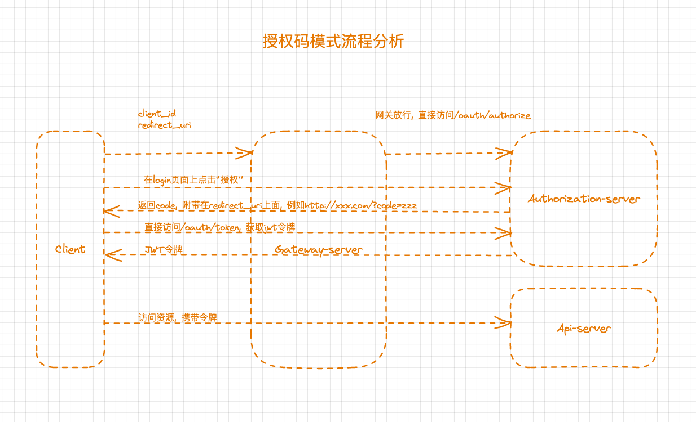

# 项目结构
- authorization-server oauth2认证服务器
- gateway-server 在微服务体系中，它是api网关服务器，在oauth2认证体系中，它是resource server资源服务器
- api-server 在微服务体系中，它是API业务服务器

# oauth2认证技术实现方案
- Spring Security
- Spring Security OAuth2
- Spring Cloud Gateway 充当 Resource Server
- 采用Oauth2.0 的password密码授权模式

> 目前OAuth2.0体系中的 Client、resource server 相关功能已经迁移到Spring Security5.X中, Authorization Server相关功能已经停止维护，新的替代方案是Spring Authorization Server，目前处于社区维护当中。
> Spring Security OAuth 项目处于停止维护状态。可以关注 Spring Security 项目 5.x 的发展进度。

> 新版OAuth2.1规范中，不推荐password密码授权模式和 简单隐式授权模式

## 一.搭建认证服务器 authorization-server
1. 添加相关依赖
```
<!-- redis -->
<dependency>
    <groupId>org.springframework.boot</groupId>
    <artifactId>spring-boot-starter-data-redis</artifactId>
</dependency>
<!-- nimbus jose jwt -->
<dependency>
    <groupId>com.nimbusds</groupId>
    <artifactId>nimbus-jose-jwt</artifactId>
    <version>8.21</version>
</dependency>
<!-- spring security oauth2 -->
<dependency>
    <groupId>org.springframework.security.oauth</groupId>
    <artifactId>spring-security-oauth2</artifactId>
    <version>2.4.2.RELEASE</version>
</dependency>
<!--  spring security -->
<dependency>
    <groupId>org.springframework.boot</groupId>
    <artifactId>spring-boot-starter-security</artifactId>
</dependency>
```

2. 添加application.properties配置
```properties
spring.application.name=authorization-server
server.port=8001
spring.redis.database=0
spring.redis.host=localhost
spring.redis.port=6379
spring.redis.password=
```

3. 生成RSA证书
`keytool -genkey -alias jwt -keyalg RSA -keystore jwt.jks`
输入密码 `testpass` 输入相关信息后确认，生成jks文件，放至`resources`目录下

4. 创建用户管理类UserServiceImpl 实现UserDetailService接口，加载用户登陆信息;
5. 创建客户端管理类ClientServiceImpl 实现ClientDetailService接口，加载客户端登陆信息;
6. 添加认证服务相关配置类，配置UserServiceImpl,ClientServiceImpl服务以及RAS密钥对keyPair;
7. 添加JWT增强器 实现TokenEnhancer接口，添加自定义信息;
8. 暴露认证服务的密钥对公钥接口，提供给外部服务获取公钥，从而能够进行签名验证;
9. 添加Spring Security配置类，放行获取公钥接口的访问;
10. 创建资源服务ResourceServiceImpl，初始化的时，把资源与角色匹配关系缓存到Redis中，方便网关服务进行鉴权的时候获取;

## 二.搭建网关服务器(资源服务器resource server) gateway-server
1. 添加相关依赖
```
<dependency>
    <groupId>org.springframework.boot</groupId>
    <artifactId>spring-boot-starter-data-redis</artifactId>
</dependency>
<dependency>
    <groupId>org.springframework.boot</groupId>
    <artifactId>spring-boot-starter-oauth2-resource-server</artifactId>
</dependency>
<dependency>
    <groupId>org.springframework.cloud</groupId>
    <artifactId>spring-cloud-starter-gateway</artifactId>
</dependency>
<dependency>
    <groupId>org.springframework.boot</groupId>
    <artifactId>spring-boot-configuration-processor</artifactId>
    <optional>true</optional>
</dependency>
```

2. 添加application.properties配置
3. 添加Spring Security配置类，因为Spring Cloud Gateway 采用的是webflux，使用`@EnableWebFluxSecurity`注解开启;
4. 在WebFluxSecurity中, 自定义鉴权操作需要实现ReactiveAuthorizationManager接口;
5. 实现一个全局过滤器AuthGlobalFilter，当鉴权通过后将JWT令牌中的用户信息解析出来，然后存入请求的Header中，这样后续服务就不需要解析JWT令牌了，可以直接从请求的Header中获取到用户信息;

## 三.搭建api服务器 api-server
1. 添加两个接口 /api/hello/hello , /api/user/currentUser

## 四.password模式访问
1. 使用password密码模式, 获取jwt令牌 
```http request
POST http://localhost:8002/oauth/token
Content-Type: application/x-www-form-urlencoded

grant_type=password&client_id=client-app&client_secret=123456&username=admin&password=123456
```

2. 使用jwt令牌访问需要权限的接口
```http request
GET http://localhost:8002/api/hello/hello
Authorization: bearer {{合法token}}}
```

## 五.authorized_code授权码模式访问


> 本项目访问授权服务器经过来网关服务器，需要在路由配置中放行相关路由的访问 /oauth/token, /oauth/authorize, /login

1. 使用code授权码模式, 首先访问 `http://localhost:8002/oauth/authorize?response_type=code&client_id=client-app-2&redirect_uri=https://www.baidu.com`
2. 点击"authorize"，进行授权
3. 重定向到回调地址 `https://www.baidu.com/?code=exbDV5`, 获取code后，请立即进行第四步，code可能会在一段时间后失效
4. 访问获取jwt令牌
```http request
POST http://localhost:8002/oauth/token
Content-Type: application/x-www-form-urlencoded

grant_type=authorization_code&client_id=client-app-2&client_secret=123456&code=gXp-0n&rediect_uri=https://www.baidu.com
```

5. 使用jwt令牌访问需要权限的接口


# 参考文章
- [理解Oauth2.0](http://www.ruanyifeng.com/blog/2014/05/oauth_2_0.html)
- [spring-cloud-gateway-oauth2](https://github.com/it-wwh/spring-cloud-gateway-oauth2)
